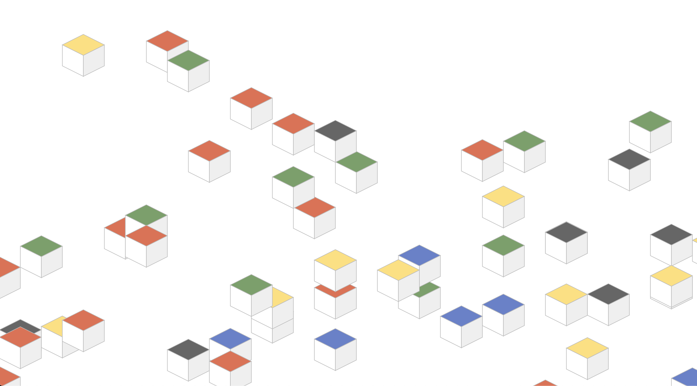

# scrolly-svelte-boxes: reactive web block component 

see the [demo](https://scrolly-boxes.demo.admataz.com)

a web component made with [svelte.js](https://svelte.dev)

These blocks are the [backdrop to my website](https://admataz.com) - and provide a scrolly-reactive, fun bit of colour and movement. 

[Previous versions were in ractive and react.js](https://github.com/admataz/scrolly-boxes) - but this one is made with svelte.js - and is the first time I've made it into an actual web component - which allows for more flexible reuse on my pages - and a leaner load. 

For fun and learning. 

&copy; adam davis 2020 [MIT](./LICENSE.txt)

